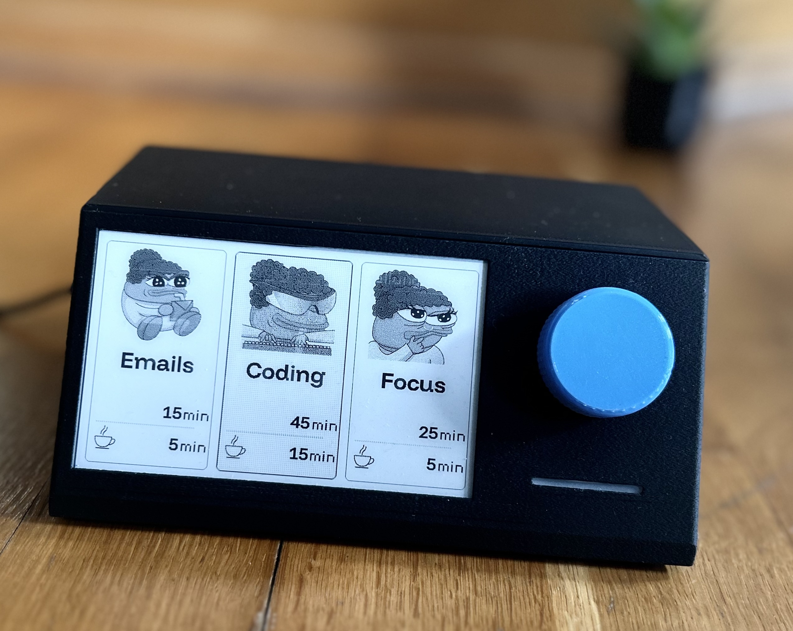
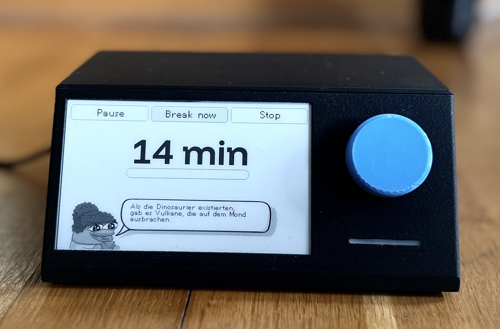
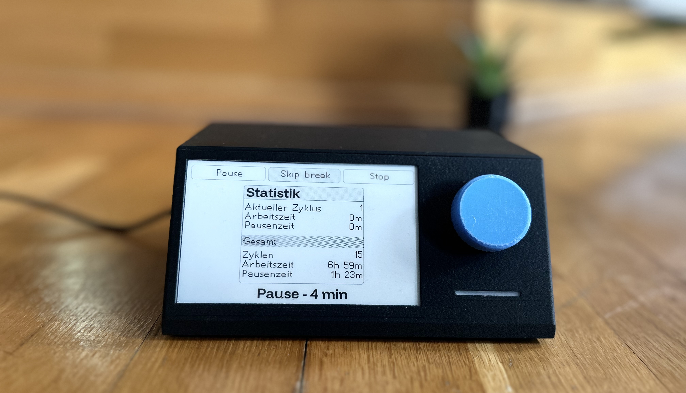

This is the repository for an ESP32 based focus timer. Originally from [@Rukenshia](https://github.com/Rukenshia/pomodoro/tree/main), my friend and I decided to use his project as a base and tweak along the way. The original builder left it unfinished to adapt to our needs, we felt it was the perfect case study. It uses an ePaper display and a rotary dial for input. 

## contributors:
- @qmcwilli - Software/Computer Eng. & musician


## Project Origin

We wanted to build something. We came up with a few ideas and this is our first. It's been fun so far. 

## our "upgrade list""
- moving from presets to customizable timers. 
- more nerdy task math in `statistics.h`
- replace `anniversary` with new easter egg(s)
- 


# Stack & requirements
C++17, Arduino/PlatformIO, GxEPD2 (e-paper), NeoPixelBus (LED), ESP32Encoder, FreeRTOS, Python 3.13+


## our Parts List
- [] insert parts list

## Using the Device --to be edited--

When the device starts up, you can either change some settings or go into preset selection mode. From there, you can choose one of three presets:



The timer will then start and let you know once the time is up (by flashing the LED and displaying a message on the screen). You can keep working (not recommended, but necessary if you want to finish something) and then start the break.



During the pause, you can view some statistics. Every few iterations (4 by default), your pause will be longer to give you some time to recover.



## Development

### Prerequisites

- PlatformIO (I used the VSCode extension)
- Python 3.13+ for asset (re)generation

### Generating Assets

In order to prepare images, icons, and fonts, you will need to run the `generate_assets.py` script. This script will take care of resizing images, converting them to the correct format, and generating the necessary C++ code to include them in the project.

```bash
# install dependencies with uv or a different package manager
uv sync

uv run scripts/generate_assets.py
```

ex 2.

```bash

poetry sync

poetry run scripts/generate_assets.py
```


### Customizing Presets

The presets are defined in `src/main.cpp`:

```cpp
  timer.addPreset(iconProvider->getPresetIcon("Emails"), iconProvider->getTimerRunningBackgroundImage(), "Emails", 15 * MINUTE, 5 * MINUTE, 15 * MINUTE);
  timer.addPreset(iconProvider->getPresetIcon("Coding"), iconProvider->getTimerRunningBackgroundImage(), "Coding", 45 * MINUTE, 15 * MINUTE, 30 * MINUTE, 2);
  timer.addPreset(iconProvider->getPresetIcon("Focus"), iconProvider->getTimerRunningBackgroundImage(), "Focus", 25 * MINUTE, 5 * MINUTE, 20 * MINUTE);
```
